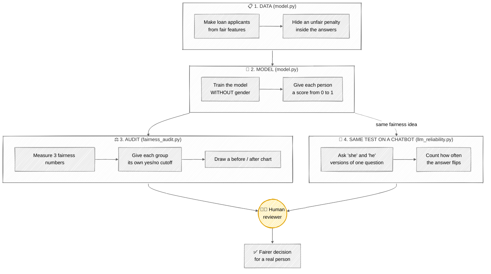
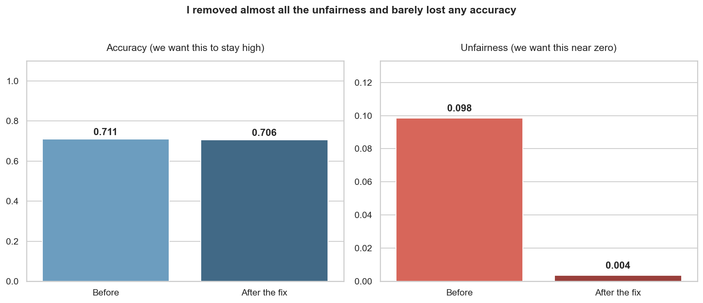

# ⚖️ FairnessAudit-AI

A small toolkit I am building to check AI models for unfairness, fix some of it,
and run the same check on chatbot AIs (LLMs).

Alongside my cloud background, I love learning and doing hands-on research in
LLMs, agentic AI, MCP servers, and trustworthy AI. This project is that passion
in action.

> New to these words? There is a plain-English **Glossary** at the bottom. Every
> hard term is explained there in one line.

## 🗺️ How it all works (whiteboard workflow)

Here is the whole project sketched on a whiteboard. Data comes in at the top. The
audit and the fix sit in the middle. A human makes the final call, because a
person should decide important things, not a machine. The dotted branch shows the
same fairness idea reused on a chatbot AI.



## ✨ What the project shows, in one line each

1. Hiding someone's gender from the model does not make it fair. It still learns
   to be unfair in an indirect way.
2. I can measure that unfairness with three simple numbers.
3. I can reduce the unfairness with a small change, and barely lose any accuracy.
4. The same fairness check also works on a chatbot AI.

## 📁 The files

| File | What it does, simply |
| --- | --- |
| `model.py` | Makes a pretend loan dataset. Some unfairness is hidden inside it on purpose. Then it trains a basic AI model. |
| `fairness_audit.py` | Measures the unfairness with three numbers. Then fixes most of it. Then draws a chart. |
| `llm_reliability.py` | Tests a chatbot style AI. It changes "she" to "he" in a question and checks if the answer changes. |
| `tests/` | Small unit tests that check the data, the metrics, and the chatbot probe. |

## 🚀 How to run it

You type these lines one at a time in a terminal:

```bash
pip install -r requirements.txt

python model.py             # step 1: make the data and train the model
python fairness_audit.py    # step 2: measure the unfairness, then fix it
python llm_reliability.py   # step 3: test the chatbot AI
```

It all runs on your own computer. You do not need the internet. You do not need a
paid AI account. To run the tests: `pip install -r requirements-dev.txt` then `pytest`.

## 📊 The three fairness numbers, in plain words

I wrote these three checks myself, by hand, so I truly understand them.

1. **Statistical parity.** Do both groups get approved at the same rate? Easy to
   understand. But it ignores who actually deserved a loan.
2. **Disparate impact.** The same idea, but written as a ratio. A famous rule
   says that if one group gets under 80% of what the other gets, that is a
   warning sign.
3. **Equal opportunity.** Out of the people who would truly repay the loan, do
   both groups get approved equally? I trust this one the most. It is fair to
   people who deserve the loan, no matter their group.

There is no single "correct" fairness number. Picking one is a choice about
values. Being honest about that choice is part of doing this the right way.

## 📈 What happened when I ran it

These results come straight from my scripts. Your numbers may be a tiny bit
different.

- The model was about **71% accurate**. But it was still unfair between the two
  groups, even though I never told it anyone's gender. Hiding gender did not help.
- One small fix removed almost all of the unfairness. The accuracy dropped by
  less than 1%. That is a great trade.
- On the chatbot test, just changing "she" to "he" flipped the decision for about
  **11 out of every 100 people**.

The chart below tells the story. On the left, accuracy barely moves. On the right,
the unfairness drops almost to zero.



## 📖 Glossary (plain English)

- **AI model / classifier.** A program that looks at information and makes a yes
  or no guess. Here it guesses "approve this loan" or "reject it".
- **LLM (large language model).** A chatbot style AI, like the one behind ChatGPT
  or Claude. It reads text and writes text back.
- **Bias / unfairness.** When the AI treats one group of people worse than
  another, for no fair reason.
- **Sensitive attribute.** A personal detail we must be careful with, like gender
  or race.
- **Accuracy.** How often the AI's guess is correct overall.
- **Fairness metric.** A number that measures how fairly the AI treats different
  groups.
- **Threshold.** The cutoff line for a yes or no decision. Move the line and you
  change how many people get approved.
- **Counterfactual test.** Change one small detail (like "she" to "he"), keep
  everything else the same, and see if the answer changes.
- **MLOps.** The practice of running AI systems reliably in the real world, the
  way IT teams keep servers running.

## ⚠️ What this project cannot do yet (being honest)

I would rather say these first than have someone catch me.

- The loan data is made up by me. That is good for testing, but real data is
  messier.
- My fix is a simple starting point. It may not work in every situation.
- The chatbot in my test is a small fake one. It shows the idea. It is not a real
  chatbot yet.
- I only check one thing (gender). Real life is more complex, because people
  belong to many groups at once.

## 📜 License

MIT. You are free to use it, learn from it, and tell me where I am wrong.

Work in progress. More coming soon.
