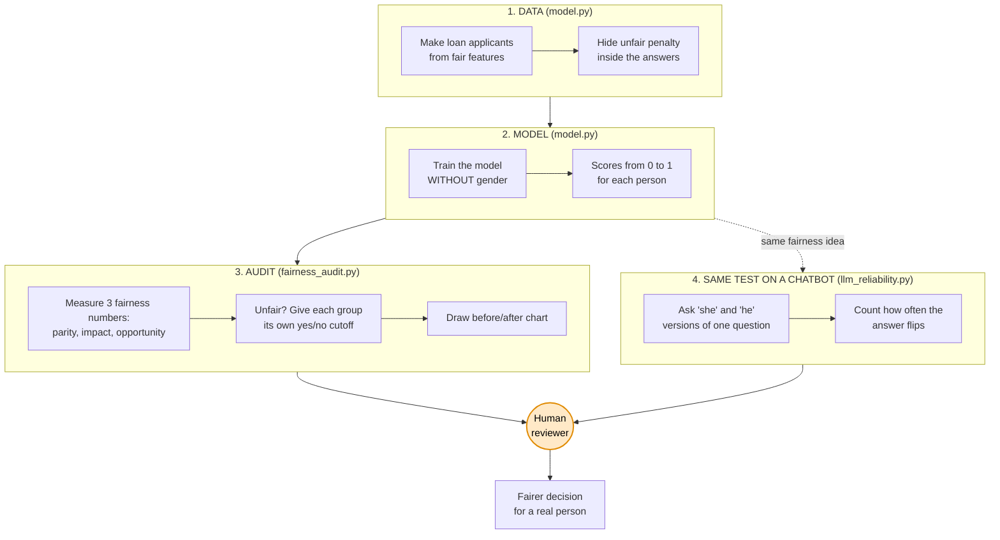

# FairnessAudit-AI

A small toolkit I am building to check AI models for unfairness, fix some of it,
and run the same check on chatbot AIs (LLMs).

Alongside my cloud background, I love learning and doing hands-on research in
LLMs, agentic AI, MCP servers, and trustworthy AI. This project is that passion
in action.

> New to these words? There is a plain-English **Glossary** at the bottom. Every
> hard term is explained there in one line.

## How it all works (the big picture)

This diagram is the whole project on one screen. Data comes in on the left. The
audit and the fix sit in the middle. A human makes the final call on the right,
because a person should decide important things, not a machine. The dotted branch
shows the same fairness idea reused on a chatbot AI.

## What the project shows, in one line each

1. Hiding someone's gender from the model does not make it fair. It still learns
   to be unfair in an indirect way.
2. I can measure that unfairness with three simple numbers.
3. I can reduce the unfairness with a small change, and barely lose any accuracy.
4. The same fairness check also works on a chatbot AI.

Work in progress. More coming soon.
